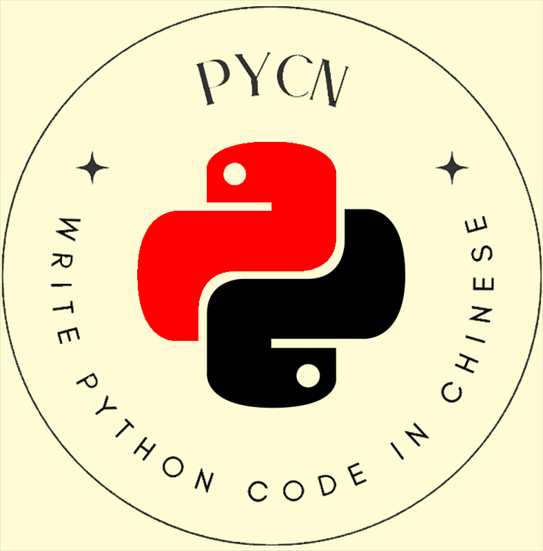

<div align="center">
    
    <h1>PyCN</h1>
    <b>用中文写Python代码, 图一乐～(∠・ω< )⌒★</b>
    <br/>
    <div>中文文档 | <a href="./README_en.md" target="_blank">English</a></div>
</div>

<br/>


# 游乐场

快速体验**Pycn**：https://mayu.vince-g.xyz/code-runner

记得把语言切换至 `pycn`


# 预览


# 使用文档

在这里查看PyCN使用文档：https://pycn.vince-g.xyz/zh_hans/

# 构建

## 本地构建

```shell
# pycn
cargo build -p pycn --release

# pycn-dylib
cargo build -p pycn-dylib --release

# wasm-nodejs
cd parser-wasm
wasm-pack build --target nodejs --out-dir output

# wasm-web
cd parser-wasm
wasm-pack build --target web --out-dir output
```

## 跨平台构建

使用 `Docker` 镜像.

### Linux arm64
```shell
docker pull vincentthegamer/rust-python-ubuntu:latest

# 进入镜像bash终端
docker run -it --rm \
           -v $(pwd):/home/pycn \
           vincentthegamer/rust-python-ubuntu bash

# 切换路径至你挂载的项目路径
cd /home/pycn

# 构建项目
cargo build -p pycn --release
cargo build -p pycn-dylib --release
```

### Linux amd64(x64)
```shell
docker pull vincentthegamer/rust-python-ubuntu-amd64:latest

# 进入镜像bash终端
docker run -it --rm \
           -v $(pwd):/home/pycn \
           vincentthegamer/rust-python-ubuntu-amd64 bash

# 切换路径至你挂载的项目路径
cd /home/pycn

# 构建项目
cargo build -p pycn --release
cargo build -p pycn-dylib --release
```