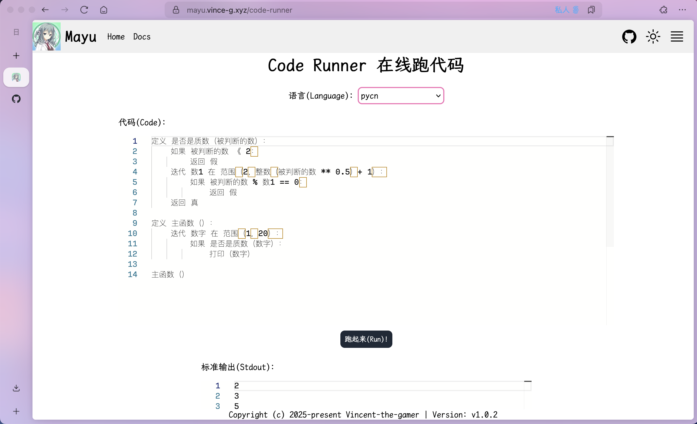

# PyCN

Write Python code in Chinese, just for fun ～(∠・ω< )⌒★

# Playground

Play **Pycn** at: https://mayu.vince-g.xyz/code-runner

Remember to switch language to `pycn`



# Installation 

## Binary

1. Download binary from [release](https://github.com/Vincent-the-gamer/pycn/releases), then `rename it` to pycn. (don't change suffix if there's a suffix), you can also copy the link and download in terminal.
```shell
# example
curl -LJO https://github.com/Vincent-the-gamer/pycn/releases/download/v1.0.0/pycn-darwin-aarch64
```

2. Put it anywhere, then add the folder to your PATH
3. Test env variable by running `pycn --help`.
4. Run pycn code by `pycn run --file xxx.pycn`

## Dylibs

PyCN provides dynamic link libraries(dylibs) for any other environment, like Node.js.

You can download dylibs from [release](https://github.com/Vincent-the-gamer/pycn/releases).

Example in Node.js:

```ts
import { close, DataType, load, open } from "ffi-rs"

// library_name, don't add suffix
// e.g. dylink-darwin-aarch64
const library = "library_name"

// path to library
const path = "/path/to/.dylib or .so or .dll"

open({
    library,
    path
})

load({
    library,
    funcName: "run_my_pycn",
    retType: DataType.Void,
    paramsType: [DataType.String],
    paramsValue: [`定义 是否是质数（被判断的数）：
    如果 被判断的数 小于 2：
        返回 假
    迭代 数1 在 范围（2，整数（被判断的数 取幂 0.5）加 1）：
        如果 被判断的数 取余 数1 等于 0：
            返回 假
    返回 真

定义 主函数（）：
    迭代 数字 在 范围（1，100）：
        如果 是否是质数（数字）：
            打印（数字）

    布尔值1 赋值为 1 大于 2 和 1 小于 3
    布尔值2 赋值为 1 大于 2 或 1 小于 3
    
    打印（布尔值1）
    打印（布尔值2）
    
主函数（）
`]
})

close(library)
```

## WebAssembly code parser
This wasm package is only to parse `.pycn` to Python code, you can run it with [PyOxidizer](https://github.com/indygreg/PyOxidizer).

Download wasm package from [release](https://github.com/Vincent-the-gamer/pycn/releases).

# Examples

Keywords mapping from `pycn` to `Python`: `key => value`

- def => 定义
- if => 如果
- else => 否则
- elif => 要不然
- for => 迭代
- enumerate => 索引迭代
- while => 当
- in => 在
- is => 是
- not => 不是
- and => 和
- or => 或
- None => 空
- True => 真
- False => 假
- return => 返回
- break => 跳出
- continue => 继续
- pass => 过
- import => 导入
- from => 从
- as => 作为
- class => 类
- try => 尝试
- except => 意外情况
- finally => 最终
- raise => 举起
- assert => 断言
- del => 删除
- global => 全局的
- nonlocal => 非局部
- lambda => 拉姆达
- yield => 产出
- await => 等待
- async => 异步的
- with => 带上
- match => 匹配
- case => 情况
- print => 打印


Operators in Chinese:
- \+ => 加
- \- => 减
- \* => 乘
- / => 除
- // => 地板除
- = => 赋值为
- % => 取余/取模
- ** => 取幂
- & => 按位与
- | => 按位或
- ^ => 按位异或
- ~ => 按位取反
- << => 左移
- \>> => 右移


> [!NOTE]
> You can run these examples by `pycn run -f examples/xxx.pycn`

- [函数.pycn](examples/函数.pycn)
- [索引迭代.pycn](examples/索引迭代.pycn)
- [打印.pycn](examples/打印.pycn)
- [导入.pycn](examples/导入.pycn)
- [类.pycn](examples/类.pycn)
- [位运算.pycn](examples/位运算.pycn)

# Build

## Locally

```shell
# pycn
cargo build -p pycn --release

# pycn-dylib
cargo build -p pycn-dylib --release
```

## Cross Platform

Use `Docker` image.

### Linux arm64
```shell
docker pull vincentthegamer/rust-python-ubuntu:latest

# Enter image bash
docker run -it --rm \
           -v $(pwd):/home/pycn \
           vincentthegamer/rust-python-ubuntu bash

# Change directory to your volume map.
cd /home/pycn

# Build project
cargo build -p pycn --release
cargo build -p pycn-dylib --release
```

### Linux amd64(x64)
```shell
docker pull vincentthegamer/rust-python-ubuntu-amd64:latest

# Enter image bash
docker run -it --rm \
           -v $(pwd):/home/pycn \
           vincentthegamer/rust-python-ubuntu-amd64 bash

# Change directory to your volume map.
cd /home/pycn

# Build project
cargo build -p pycn --release
cargo build -p pycn-dylib --release
```