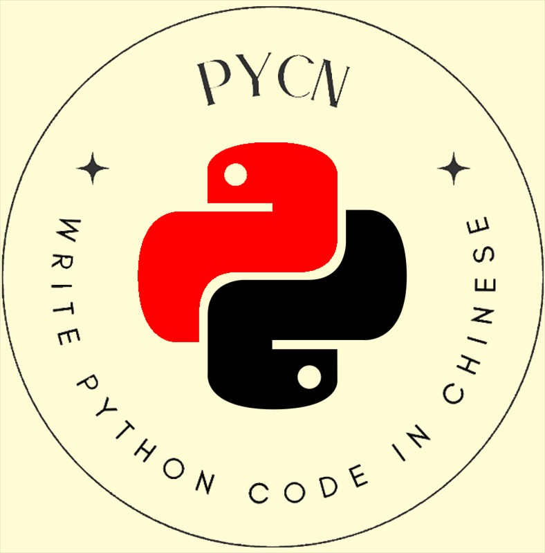

<div align="center">
    
    <h1>PyCN</h1>
    <b>用中文写Python代码, 图一乐～(∠・ω< )⌒★</b>
    <br/>
    <div>中文文档 | <a href="./README_en.md" target="_blank">English</a></div>
</div>

<br/>

# 预览


# 使用文档

在这里查看PyCN使用文档：https://pycn.vince-g.xyz/zh_hans/

# 项目结构

```
pycn/
├── pycn/            # CLI 主程序（基于 pyo3，默认静态链接 Python）
├── pycn-dylib/      # C 动态库封装
├── parser/          # 核心解析器（logos 词法分析 + 手写递归下降解析）
├── parser-wasm/     # 解析器的 WASM 绑定（用于 Web / Node.js）
├── http-server/     # HTTP 代码执行服务（基于 Axum）
├── scripts/         # 构建与开发脚本
│   ├── setup-dev.sh      # 开发环境一键配置
│   └── build-release.sh  # 发布构建与打包
├── build/           # 构建缓存（PBS Python、pyo3 配置）
├── python-stdlib/   # Python 标准库副本（由 setup-dev.sh 生成）
└── examples/        # 示例代码
```

# 安装

从 [GitHub Releases](https://github.com/Vincent-the-gamer/pycn/releases) 下载对应平台的预编译包，解压即可使用，无需安装 Python 或 Rust。

### 支持平台

| 平台    | 架构        |
|---------|------------|
| Linux   | x64, arm64 |
| macOS   | x64, arm64 |
| Windows | x64, arm64 |

下载解压后直接运行：

```shell
./pycn run examples/打印.pycn
```

# 构建（面向开发者）

## 前置要求

- [Rust](https://rustup.rs/) 工具链
- 网络连接（首次构建需下载预编译 Python）

## 开发构建（推荐）

只需运行一次配置脚本，之后 `cargo build` / `cargo run` 开箱即用：

```shell
# 一键配置开发环境（下载独立 Python、生成配置、复制标准库）
bash scripts/setup-dev.sh

# 编译 pycn
cargo build -p pycn --release

# 运行示例
cargo run -p pycn --release -- run examples/打印.pycn
```

`setup-dev.sh` 做了什么：

1. 下载 [python-build-standalone](https://github.com/astral-sh/python-build-standalone) 预编译的独立 Python 到 `build/pbs-python/`
2. 生成 `build/pyo3-config.txt`（pyo3 链接配置）
3. 复制 Python 标准库到 `python-stdlib/`（运行时加载）
4. 写入 `.cargo/config.toml`（自动设置 `PYO3_CONFIG_FILE` 和 `PYCN_STATIC_PYTHON` 环境变量）

> [!NOTE]
> - 若需恢复使用系统 Python，删除 `.cargo/config.toml` 后使用 `cargo build --no-default-features` 构建
> - `cargo clean` 不会删除 `python-stdlib/`（在项目根目录而非 `target/` 中）

## 其他 crate 构建

```shell
# C 动态库
cargo build -p pycn-dylib --release

# Node.js / Web WASM
cd parser-wasm
wasm-pack build --out-dir output            # ES Module（默认 --target bundler）
wasm-pack build --target nodejs --out-dir output  # CommonJS
wasm-pack build --target web --out-dir output     # Web

# HTTP Server
cargo build -p http-server --release
```

## 发布构建（打包独立运行时）

```shell
bash scripts/build-release.sh
```

该脚本会自动下载 PBS Python、编译 pycn、并将二进制与 Python 标准库打包到 `target/release/pycn-standalone/`，生成一个不依赖系统 Python 的独立分发包。

# 开源证书

[MIT 证书](./LICENSE.md)

版权所有 (c) 2025-现在 Vincent-the-gamer <https://github.com/Vincent-the-gamer>
