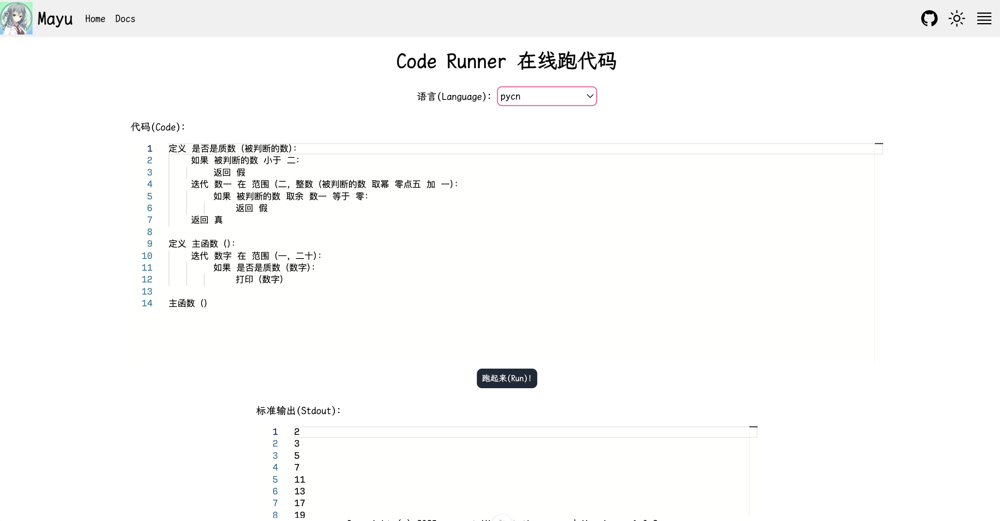

<div align="center">
    
    <h1>PyCN</h1>
    <b>用中文写Python代码, 图一乐～(∠・ω< )⌒★</b>
    <br/>
    <div>中文文档 | <a href="./README_en.md" target="_blank">English</a></div>
</div>

<br/>


# 游乐场

快速体验**Pycn**：https://mayu.vince-g.xyz/code-runner

记得把语言切换至 `pycn`



# 预览


# 安装 

## 二进制可执行文件

### 快速安装

如果你是`macOS`用户, 可以使用`homebrew`安装

```shell
brew tap vincent-the-gamer/homebrew-tap
brew install pycn
```


### 手动安装
1. 下载可执行文件： [release](https://github.com/Vincent-the-gamer/pycn/releases), `重命名`为pycn. (如果有后缀，不要修改), 你也可以复制下面的shell命令下载.
```shell
# 例子
curl -LJO https://github.com/Vincent-the-gamer/pycn/releases/download/v1.0.0/pycn-darwin-aarch64
```

2. 下载后的二进制文件随便放入一个文件夹，将这个文件夹添加进你的环境变量 PATH 中。
3. 使用 `pycn --help` 命令来测试环境变量是否生效.
4. 使用 `pycn run --file xxx.pycn` 命令来运行`.pycn` 代码

## 动态链接库

PyCN为`Node.js`等多个环境提供动态链接库(dylibs)

下载动态链接库：[release](https://github.com/Vincent-the-gamer/pycn/releases).

Node.js案例:

```ts
import { close, DataType, load, open } from "ffi-rs"

// 动态链接库名称, 不加后缀
// 例：dylink-darwin-aarch64
const library = "library_name"

// 动态链接库路径
const path = "/path/to/.dylib or .so or .dll"

open({
    library,
    path
})

load({
    library,
    funcName: "run_my_pycn",
    retType: DataType.Void,
    paramsType: [DataType.String],
    paramsValue: [`定义 是否是质数（被判断的数）：
    如果 被判断的数 小于 二：
        返回 假
    迭代 数一 在 范围（二，整数（被判断的数 取幂 零点五）加 一）：
        如果 被判断的数 取余 数一 等于 零：
            返回 假
    返回 真

定义 主函数（）：
    迭代 数字 在 范围（一，二十）：
        如果 是否是质数（数字）：
            打印（数字）

    布尔值1 赋值为 一 大于 二 和 一 小于 三
    布尔值2 赋值为 一 大于 二 或 一 小于 三
    
    打印（布尔值1）
    打印（布尔值2）
    
主函数（）
`]
})

close(library)
```

## WebAssembly代码编译器
Wasm包仅仅实现`.pycn` 转换为Python代码的功能, 要运行代码，你需要自己使用Python运行时，例如：[Pyoxidizer](https://github.com/indygreg/PyOxidizer)，这个工具可以将Python代码构建为可执行文件。

如果是网页，可以使用[Pyodide](https://github.com/pyodide/pyodide)，这是一个Wasm Python运行时。

下载Wasm包： [release](https://github.com/Vincent-the-gamer/pycn/releases).

# 语法高亮

目前，在VS Code中，可以使用`Pycn`插件来实现语法高亮

# 案例

在这里可以查看各个关键词，内置函数，运算符等名称的映射

- [关键词映射](mapping/keywords.md)
- [内置函数映射](mapping/builtin-functions.md)
- [运算符映射](mapping/operators.md)

> [!NOTE]
> 你可以使用命令： `pycn run -f examples/xxx.pycn` 来运行案例代码

- [函数.pycn](examples/函数.pycn)
- [索引迭代.pycn](examples/索引迭代.pycn)
- [打印.pycn](examples/打印.pycn)
- [导入.pycn](examples/导入.pycn)
- [类.pycn](examples/类.pycn)
- [位运算.pycn](examples/位运算.pycn)
- [中文数字.pycn](examples/中文数字.pycn)
- [匿名函数.pycn](examples/匿名函数.pycn)
- [交换变量.pycn](examples/交换变量.pycn)

# 构建

## 本地构建

```shell
# pycn
cargo build -p pycn --release

# pycn-dylib
cargo build -p pycn-dylib --release
```

## 跨平台构建

使用 `Docker` 镜像.

### Linux arm64
```shell
docker pull vincentthegamer/rust-python-ubuntu:latest

# 进入镜像bash终端
docker run -it --rm \
           -v $(pwd):/home/pycn \
           vincentthegamer/rust-python-ubuntu bash

# 切换路径至你挂载的项目路径
cd /home/pycn

# 构建项目
cargo build -p pycn --release
cargo build -p pycn-dylib --release
```

### Linux amd64(x64)
```shell
docker pull vincentthegamer/rust-python-ubuntu-amd64:latest

# 进入镜像bash终端
docker run -it --rm \
           -v $(pwd):/home/pycn \
           vincentthegamer/rust-python-ubuntu-amd64 bash

# 切换路径至你挂载的项目路径
cd /home/pycn

# 构建项目
cargo build -p pycn --release
cargo build -p pycn-dylib --release
```