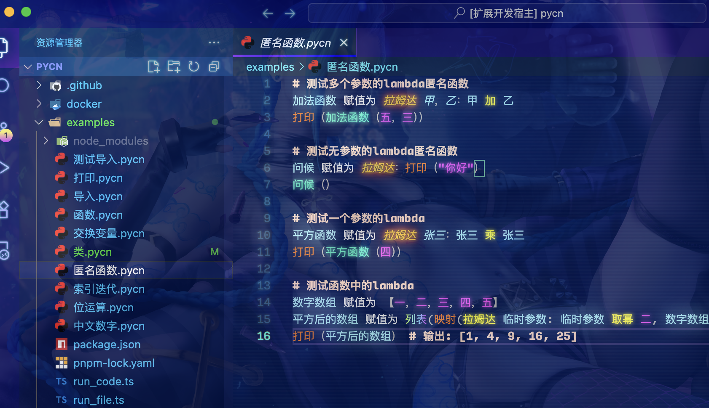

<div align="center">
    
    <h1>PyCN</h1>
    <b>Write Python code in Chinese, just for fun ～(∠・ω< )⌒★</b>
    <br/>
    <div><a href="./README.md" target="_blank">中文文档</a> | Engligh</div>
</div>

<br/>

# Playground

Play **Pycn** at: https://mayu.vince-g.xyz/code-runner

Remember to switch language to `pycn`


# Preview



# Documentation

See PyCN docs at: https://pycn.vince-g.xyz/

# Build

## Locally

```shell
# pycn
cargo build -p pycn --release

# pycn-dylib
cargo build -p pycn-dylib --release

# wasm-nodejs
cd parser-wasm
wasm-pack build --target nodejs --out-dir output

# wasm-web
cd parser-wasm
wasm-pack build --target web --out-dir output
```

## Cross Platform

Use `Docker` image.

### Linux arm64
```shell
docker pull vincentthegamer/rust-python-ubuntu:latest

# Enter image bash
docker run -it --rm \
           -v $(pwd):/home/pycn \
           vincentthegamer/rust-python-ubuntu bash

# Change directory to your volume map.
cd /home/pycn

# Build project
cargo build -p pycn --release
cargo build -p pycn-dylib --release
```

### Linux amd64(x64)
```shell
docker pull vincentthegamer/rust-python-ubuntu-amd64:latest

# Enter image bash
docker run -it --rm \
           -v $(pwd):/home/pycn \
           vincentthegamer/rust-python-ubuntu-amd64 bash

# Change directory to your volume map.
cd /home/pycn

# Build project
cargo build -p pycn --release
cargo build -p pycn-dylib --release
```

# License

[MIT License](./LICENSE.md)

Copyright (c) 2025-PRESENT Vincent-the-gamer <https://github.com/Vincent-the-gamer>