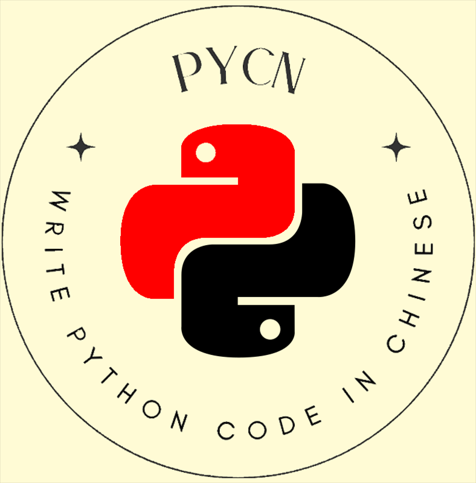

<div align="center">
    
    <h1>PyCN</h1>
    <b>Write Python code in Chinese, just for fun ～(∠・ω< )⌒★</b>
    <br/>
    <div><a href="./README.md" target="_blank">中文文档</a> | Engligh</div>
</div>

<br/>

# Playground

Play **Pycn** at: https://mayu.vince-g.xyz/code-runner

Remember to switch language to `pycn`


# Preview


# Documentation

See PyCN docs at: https://pycn.vince-g.xyz/

# Build

> [!IMPORTANT]
> Pycn static build is depending on a specific Python version, 
> so you need as same version as where you built your own pycn.
>
> e.g. If you build your pycn using Python 3.12.x(Cargo will use your default Python version), you'll need a Python 3.12.x installed environment to run this build.

```shell
# pycn
cargo build -p pycn --release

# pycn-dylib
cargo build -p pycn-dylib --release

# wasm-nodejs
cd parser-wasm
wasm-pack build --target nodejs --out-dir output

# wasm-web
cd parser-wasm
wasm-pack build --target web --out-dir output
```

# License

[MIT License](./LICENSE.md)

Copyright (c) 2025-PRESENT Vincent-the-gamer <https://github.com/Vincent-the-gamer>